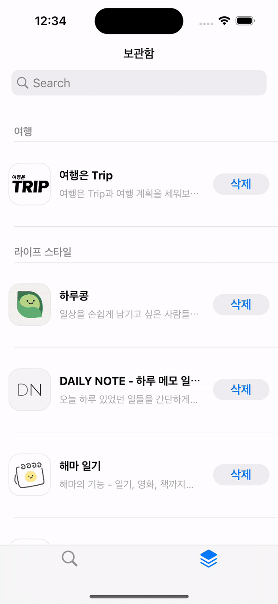

# AppStoreProject
<p align="center">
  
  
  
  
</p>

<br>

## 기술 스택
- UIKit

- 디자인 패턴 : MVVM, Repository, Input/Output

- 라이브러리 : SnapKit, Alamofire, Realm, RxSwift

- 데이터베이스 : Realm 이용. 1:N 테이블 구조

- 네트워크 : URLSession 이용. ituens search api

<br>

## 구현
### 1. Input / Output 패턴 적용

- RxSwift와 MVVM을 기반으로, Input/Output 패턴을 적용했다.
- 비즈니스 로직에 필요한 이벤트와 데이터를 Input으로 전달하고, `transform` 메서드를 통해 view에 반영해야 하는 이벤트와 데이터를 Output으로 반환한다

- 위 구조를 추상화하기 위해 ViewModelType 프로토콜을 선언한다

    ```swift
    protocol ViewModelType {
        associatedtype Input
        associatedtype Output
        
        func transform(_ input: Input) -> Output
    }
    ```


## 2. RxSwift 활용

- 이벤트에 대한 비동기 처리를 해주고자 모든 기능을 RxSwift를 활용해서 구현하였다.


1. SearchBar
    1. 검색 화면
        - 검색 버튼을 누르면 네트워크 통신이 이루어지는 구조
        - `throttle` 키워드를 이용해 중복 클릭을 방지하여 네트워크 과부하가 일어나지 않도록 했다.
            
            ```swift
            input.searchButtonClicked
                .throttle(.seconds(1), scheduler: MainScheduler.instance)
                .withLatestFrom(input.searchText) { _, query in
                    return query
                }
                .flatMap { BasicAPIManager.fetchInitialData($0) }
                .subscribe(with: self) { owner , value in
                    items.onNext(value.results)
                }
                .disposed(by: disposeBag)
            ```
            
    
    2. 보관함 화면
        - 실시간으로 입력된 텍스트에 대해 Realm에서 데이터를 불러온다
        - `debounce` 키워드를 이용해 이벤트의 타이머를 설정하여 불필요한 텍스트에 대한 호출을 줄인다.
        
            ```swift
            input.searchText
                .debounce(RxTimeInterval.seconds(1), scheduler: MainScheduler.instance)
                .distinctUntilChanged()
                .subscribe(with: self) { owner , value in
                            print("실시간 검색 : \(value)")
                    let newData = (value == "") ? owner.repository.allGenresApp() : owner.repository.searchGenresApp(value)
                    items.onNext(newData)
                }
                .disposed(by: disposeBag)
            ```
        

2. refreshControl
- 보관함 화면에서 새로고침 기능을 통한 데이터 동기화를 구상했다.
- 다른 화면에서 Realm 데이터를 수정해도 즉각적으로 화면에 반영되지 않고, refreshControl을 통해 최신 데이터를 불러오도록 구현했다.

    
    ```swift
    input.refreshControlValueChanged
        .withLatestFrom(input.searchText) { _, text in
            return text
        }
        .subscribe(with: self) { owner , text in
            print("새로고침 : \(text)")
            refreshLoading.onNext(true)
            
            DispatchQueue.main.asyncAfter(deadline: .now() + 1) {
                let newData = (text == "") ? owner.repository.allGenresApp() : owner.repository.searchGenresApp(text)
                items.onNext(newData)
                
                refreshLoading.onNext(false)
            }
        }
        .disposed(by: disposeBag)
    ```
    

3. RxDataSource
- 보관함 화면에서는 앱의 카테고리를 섹션으로 나누어 다운받은 앱 목록을 보여준다
- 섹션이 하나인 경우에는 RxSwift의 dataSource로 구현이 가능하지만, 여러 섹션을 다루기 위해 **RxDataSource** 를 활용하였다

  




<br>


## 트러블 슈팅

### 1. tableView Cell 위의 버튼 대응

첫 번째 이슈 
- tableView의 cellForRowAt 역할을 하는 코드를 items에 bind로 연결시켰기 때문에, items에 변화가 없으면 다시 실행되지 않는다.
- 셀 위의 버튼을 클릭하면 해당 데이터가 Realm에 저장 or 삭제될 뿐, 검색에 대한 응답으로 받은 데이터에는 변화가 없다.
- 따라서 버튼의 타이틀을 “받기” → “삭제”로 바꿔주어야 하는데, UI가 새로 그려지는 코드가 실행되지 않기 때문에 타이틀이 업데이트 되지 않는다


해결
- tableViewCell 클래스 내에 Realm에 저장되어 있는지 여부를 나타내는 Bool 타입 변수를 하나 생성한다.
- 처음 셀이 생성될 때, Realm에 있는지 확인 후 초기값을 지정한다.
- 버튼을 클릭하면 해당 변수값을 toggle시켜준다.
- 변수에 didSet으로 UI 업데이트 코드를 작성해서 테이블뷰를 새로 그리는 코드가 실행되지 않더라도 UI가 업데이트 되도록 한다.

<br>

두 번째 이슈

- 위 코드는 결국 View 역할을 하는 Cell 클래스 내에 data를 가지고 있는 형태가 된다.
- 데이터를 모두 ViewModel에서 관리하기 위해서는 Cell 클래스마다 ViewModel을 하나씩 가지고 있어야 하는데, View와 ViewModel이 직접적으로 연결되어 있는 형태가 어색하다고 생각했다.

해결

- 버튼 클릭에 대한 코드를 작성할 때, 위에 셀 클래스 내에서 대응하는 내용을 모두 포함시킨다.
- 즉, 버튼 클릭 → Realm에 있는지 확인 → Realm에 추가 or 삭제 → UI 업데이트 과정을 모두 버튼 클릭 시마다 실행한다.

추후 공부 예정

- cell 위의 버튼에 대한 Input / Output 구조 만들기
- 해당 셀에 대한 정보를 전달하고, 그 정보를 기반으로 셀 디자인을 다시 하는 부분에서 실패했다.

<br>

### 2. 동기화 작업

- Realm의 데이터가 업데이트 되었을 때 모든 화면에 대해 이를 동기화하는 방법을 고민했다.

- 이전 프로젝트에서 구현 방법
    1. 모든 ViewController의 `viewWillAppear` 에서 Realm 데이터를 확인하고, 이를 반영한다.
        - 굳이 확인하지 않아도 되는 경우에도 데이터를 다시 불러오기 때문에 리소스의 낭비
    2. 싱글톤 패턴으로 모든 클래스에서 접근 가능한 인스턴스 변수를 하나 생성해서, 데이터의 변화를 감지한다.
        - 다른 역할 없이 특정 데이터를 감지하는 역할로서 싱글톤 인스턴스를 메모리에 유지시키는 것은 리소스 낭비

- 해결 방법
- 캐치해야 하는 시점 : **Realm의 데이터가 업데이트 된 순간**
- **Realm Notification** 기능으로 해결 가능

    ```swift
    // Realm Notification
    var notificationToken: NotificationToken?

    func detectChangesInReview(_ trackId: Int, completionHandler: @escaping ([ReviewItemTable]) -> Void) {
        
        let data = realm.objects(AppReviewTable.self).where {
            $0.trackId == trackId
        }
        
        notificationToken = data.observe { changes in
            switch changes {
            case .initial(let data):
                print("initial : \(data)")
                
            case .update(let data, _, _, _):
                print("update : \(data)")
                completionHandler(Array(data[0].appReviews))
                
            case .error(let error):
                print("error : \(error)")
                
            }
        }
    }
    ```

<Br>

### 3. RxCocoa에서 제공하지 않는 메서드

- Input / Output 패턴을 사용하면 특정 이벤트가 발생함을 `ControlEvent<Void>` 로 전달해준다.
- RxCocoa에서 제공하는 `tableView.rx.itemSelected`, `refreshControl.rx.controlEvent(.valueChanged)`는 그대로 전달해주면 되지만, 이러한 메서드가 없을 때는 원하는 이벤트가 발생한 시점을 전달해줄 수 없었다.

<Br>

해결 방법
- **Reactive** 클래스를 확장해서 새로운 메서드를 선언한다
    - ScrollView를 맨 아래까지 스크롤 했을 때 이벤트가 전달되도록 메서드를 구현한다.
    ```swift
    extension Reactive where Base: UIScrollView {
        
        func reachedBottom(from space: CGFloat = 0.0) -> ControlEvent<Void> {
            
            let source = contentOffset.map { contentOffset in
            let visibleHeight = self.base.frame.height - self.base.contentInset.top - self.base.contentInset.bottom
            let y = contentOffset.y + self.base.contentInset.top
            let threshold = self.base.contentSize.height - visibleHeight - space
            return y >= threshold
            }
            .distinctUntilChanged()
            .filter { $0 }
            .map { _ in () }

            return ControlEvent(events: source)
        }
    }
    ```

- RxCocoa의 메서드를 사용하는 것처럼 UIScrollView를 상속한 클래스의 인스턴스에 대해 메서드를 사용할 수 있고, Input으로 전달해줄 수 있다.
